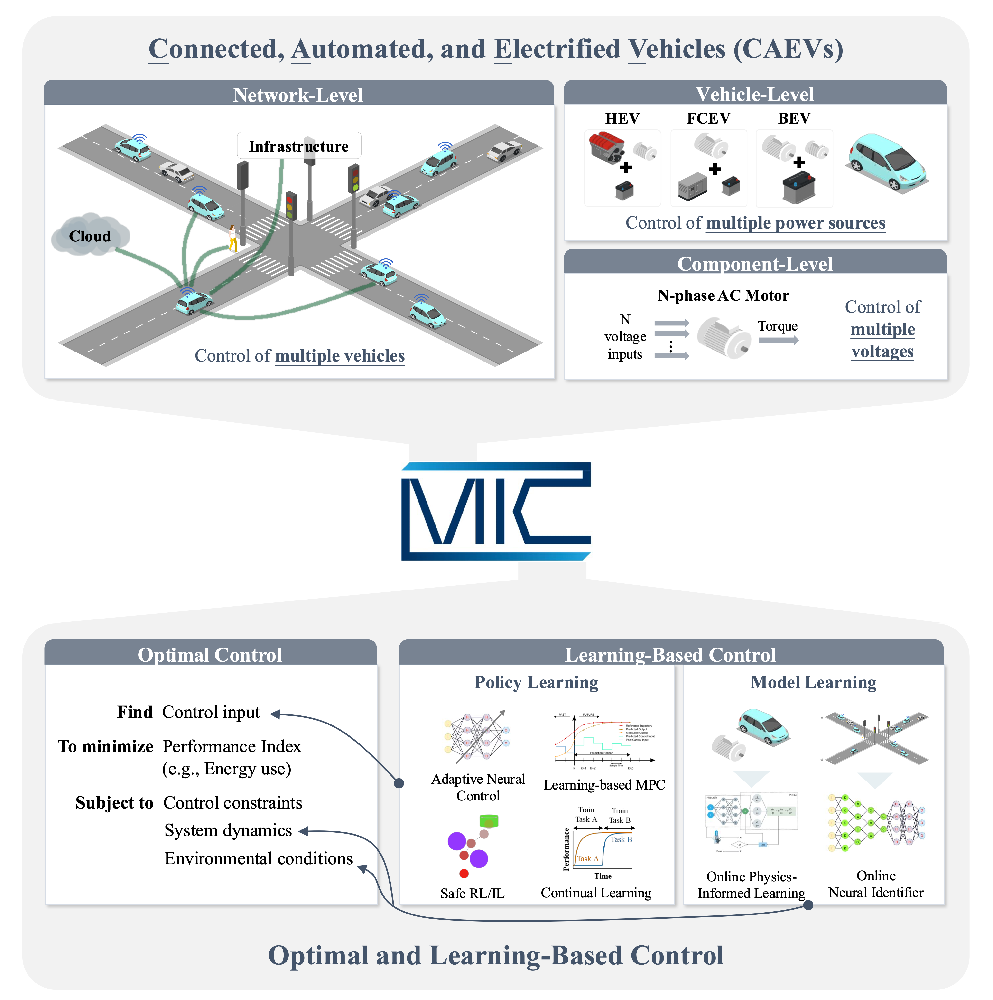

  
## <b>Intelligent Media Lab</b>
<!-- {: .welcomefont} -->
#### The Birthplace of Media AI
<!-- {: .welcomefont} -->

 
The Intelligent Media Lab, founded in 2002, was established with a vision far ahead of its time: to explore how artificial intelligence could evolve into an intelligent medium that seamlessly connects humans, digital information, and the physical world. 
At a time when artificial intelligence was primarily focused on algorithms and computational models, the lab proposed a broader perspective one in which AI would eventually become an interactive and immersive medium through which humans communicate, create knowledge, and interact with intelligent systems. This vision laid the conceptual foundation for what we now describe as Media AI. 
For more than two decades, the Intelligent Media Lab has pursued this vision by conducting research across a wide range of core technologies that form the building blocks of Media AI. These include artificial intelligence, computer vision, immersive media, virtual and augmented reality, and interactive systems such as computer games. Through these efforts, the lab has developed technologies that enable intelligent perception, interactive environments, and seamless integration between digital systems and the physical world. 
Today, as artificial intelligence rapidly advances through new paradigms such as generative AI, agentic AI, and physical AI, the original vision proposed by the Intelligent Media Lab is becoming increasingly relevant. The concept of Media AI represents the next stage of this evolution an era in which artificial intelligence functions as an intelligent medium embedded in human environments, enabling natural interaction, autonomous assistance, and immersive experiences across digital and physical domains. 
Over the past 24 years, the lab has also played a significant role in cultivating global talent. The Intelligent Media Lab has trained and graduated numerous master’s and doctoral students, many of whom have gone on to become leaders in academia and industry. Alumni of the lab include tenured professors at major universities such as Sungkyunkwan University, as well as researchers and engineers working at leading global institutions including Boeing in Seattle and other international technology organizations. 
Through continued research, innovation, and education, the Intelligent Media Lab remains committed to advancing the frontier of Media AI, shaping a future where artificial intelligence serves as the fundamental medium through which humans experience, understand, and transform the world.
<!-- {: .welcomefont} -->

  <!--  -->
  <!--  -->
  

